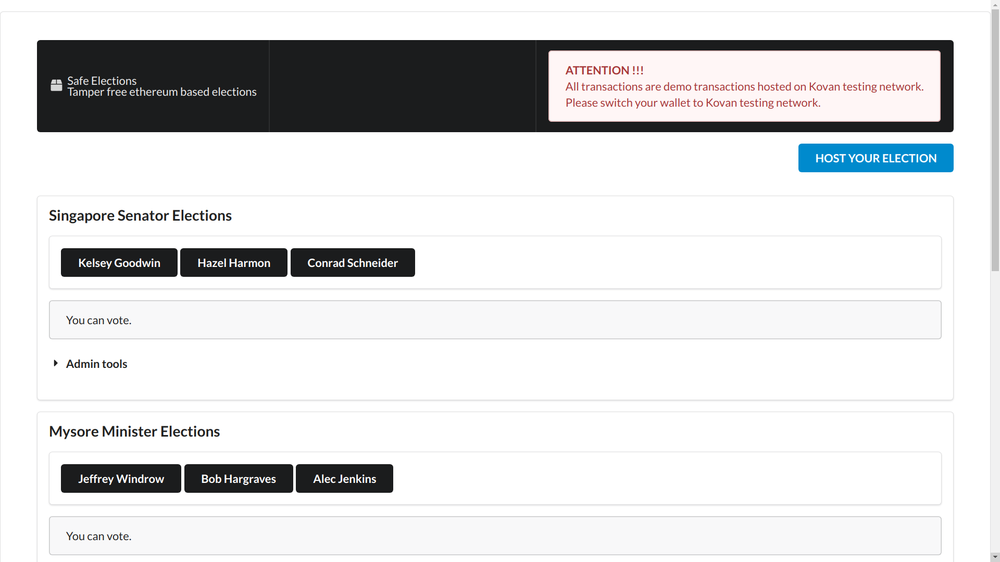

# Safe Elections: A tamper free election service based on Ethereum

## Intro
The aim of this project is to make an application where independent and trustless elections can be held. The app has several features implemented and all bundled into one React application.

<b>The app is configured for Kovan test network.</b>

## How to participate online ?
 - Visit from desktop: [Safe Elections](https://akcgjc007.github.io/SafeElections/)
 - Make sure you have a metamask wallet
 - Make sure you are switched to Kovan test network
 - Make sure you have some test ethers
 - Have fun then!

## Features
 - New elections can be hosted
 - Each voter:
   - can vote strictly once
   - can only vote if voting is not ended by admin
 - Admin:
   - can access the *admin tools* section
   - can end the voting

## Technology used
 - Smart contract in solidity
 - Node.js, React.js, Javascript
 - Semantic UI React

## How to run ?
 - `yarn i`
 - `yarn start`
 - `yarn compile`
 - `yarn test`

## Sample

## Contributors
<table><tr><td align="center">
        <a href="https://github.com/akcgjc007">
            
             
            <b>Anupam Kumar</b>
        </a>
    </td></tr>
</table>
